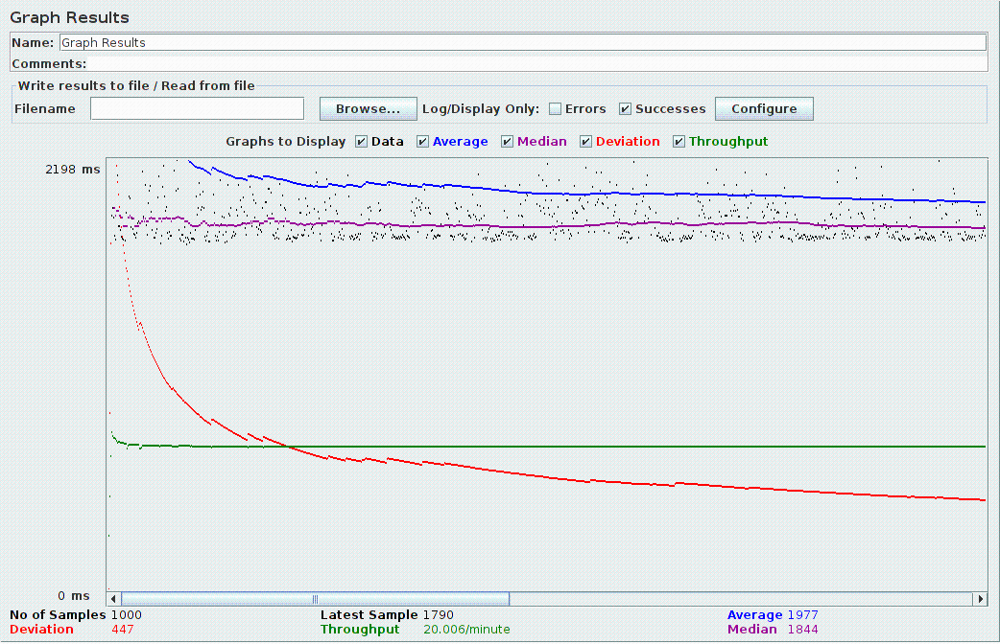
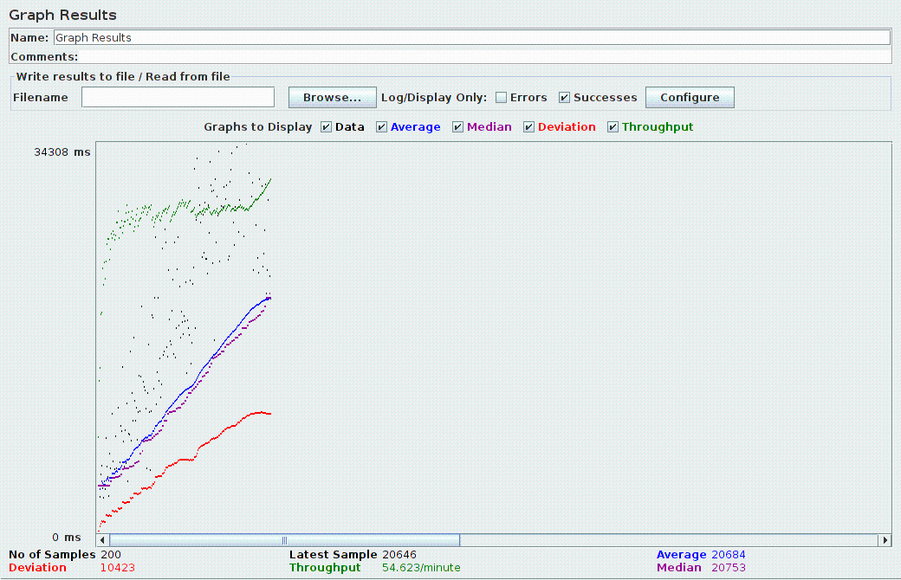
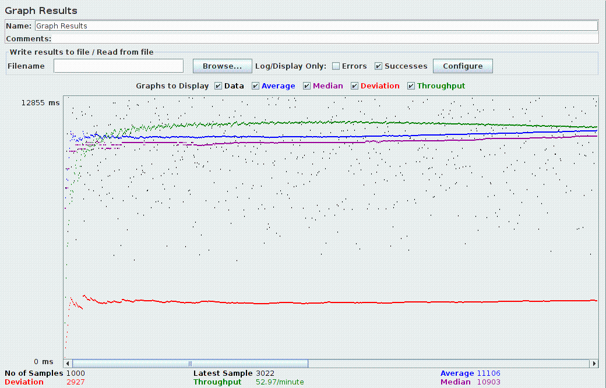
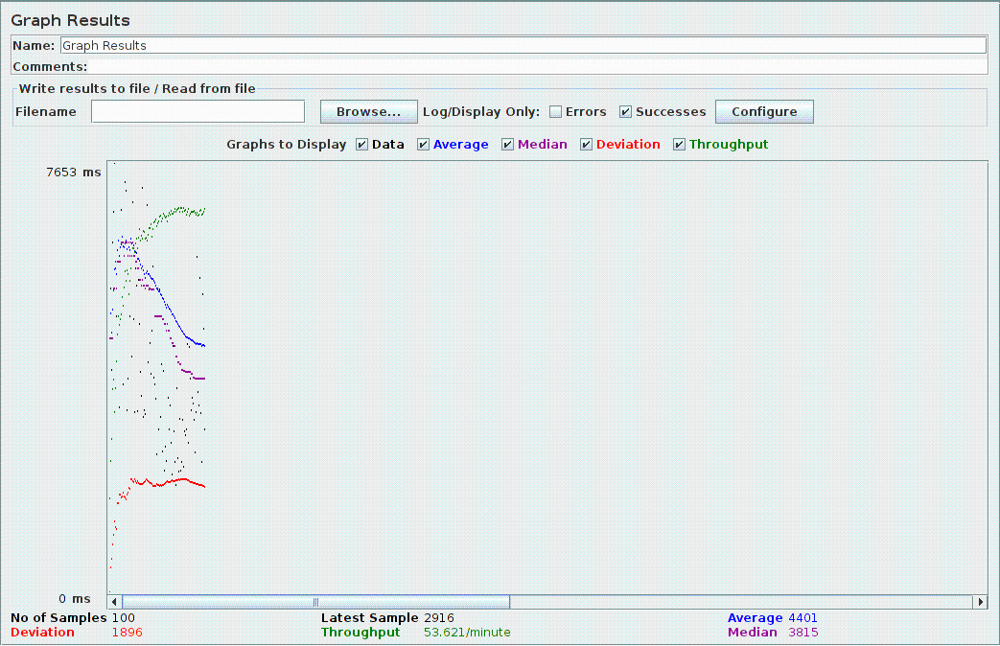
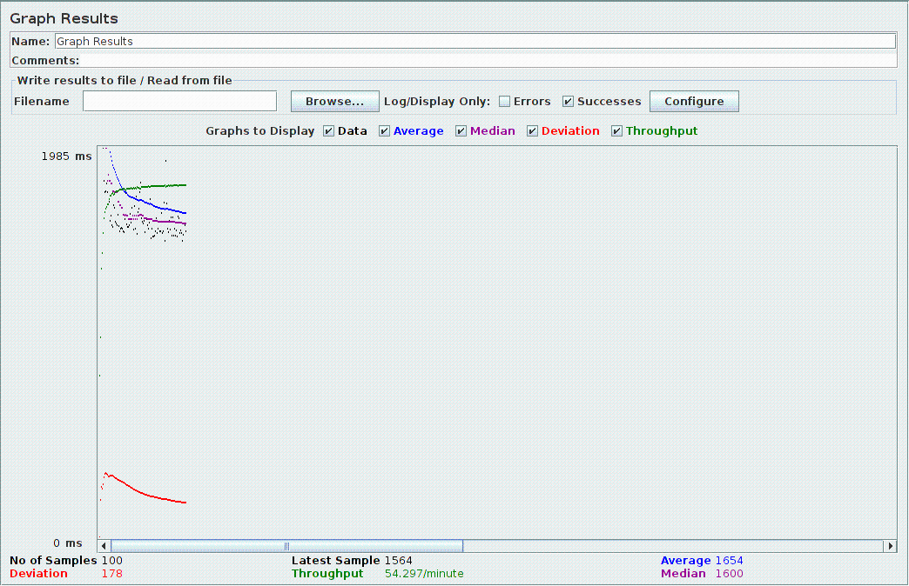
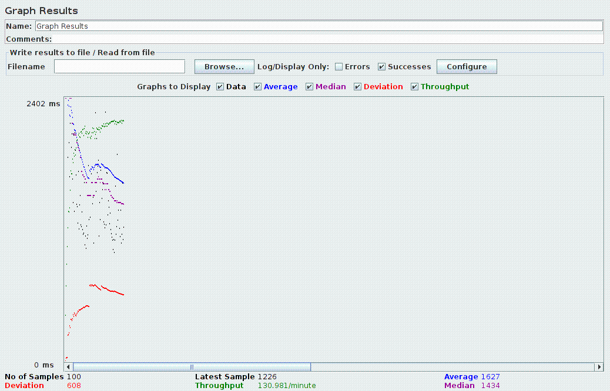
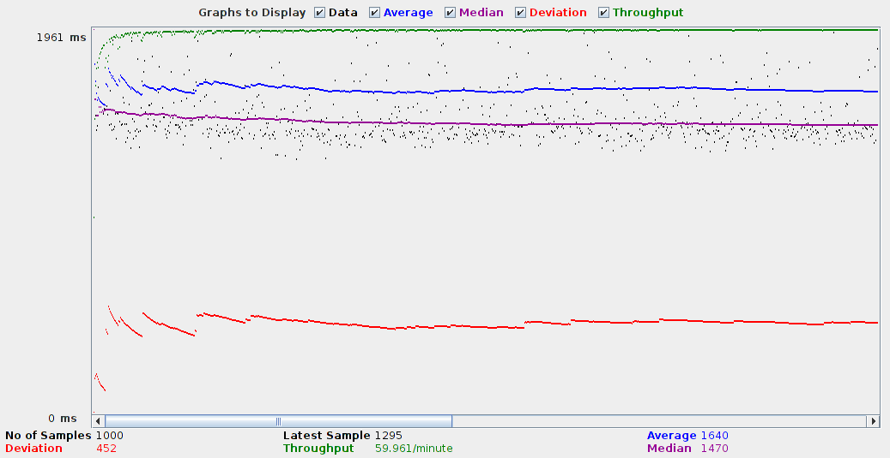

Rendimiento servicios
=======================

Todas las pruebas realizadas a continuación se han hecho atacando a 
los servicios de forma local y estos a geonetwork de forma
remota (en cíclope).

Las pruebas están hechas a fecha 11/1/2012. El hash del último commit
es "fa1e976". 

Servicio de búsqueda
-----------------------

Tests sin filtro
^^^^^^^^^^^^^^^^^

Los siguientes tests se han realizado con una petición que
devuelve la primera página de 25 resultados sin hacer ningún filtro.

Uso continuado
.................

Se lanzan 1000 peticiones sin filtros en 3000 segundos. Es
decir, una petición cada 3 segundos. Como cada petición tarda menos de
3 segundos no hay concurrencia. El objetivo de esta prueba es ver el
uso continuado del servidor sin estreses puntuales.

**Resultados**

Se observa en el *manager* de Tomcat que el número de sesiones
abiertas en geonetwork crece por cada petición. El valor más grande
observado es de 5759, sin que esto afecte al rendimiento
aparentemente. Se observa que el número decrece con el tiempo. Al
parecer se trata de un timeout elevado.

La siguiente figura muestra los resultados obtenidos.

   
   Resultados búsqueda continua sin concurrencia.

Uso intenso "real"
.....................

Se lanzan 200 peticiones sin filtros en 200 segundos. Es
decir, una petición cada segundo. El grado de concurrencia es bastante
alto. El objetivo es estresar GN para ver en qué punto se rompe.

**Resultados**

Todas las peticiones fueron servidas.

Se da concurrencia creciente, alcanzando más de 30 clientes
simultáneos. Los tiempos se incrementan proporcionalmente a la
concurrencia, como puede verse en la siguiente figura:

Se puede apreciar que la productividad es casi el doble de lo que se podría obtener
encadenando peticiones una detrás de otra (0.5 peticiones/s).

Uso más intensivo
.....................

Se lanzan 10 peticiones sin filtros en 2 segundos pero el
loop se pone a 100. Aparentemente, loop lo hace es enviar una nueva
petición cada vez que se completa una para mantener 10 peticiones
simultáneas hasta que se han consumido las 100*10 peticiones.
Conclusión, se crece de 0 a 10 peticiones en dos segundos y se
mantienen las 10 hasta el final del test.

**Resultados**

Se pueden ver en la siguiente figura3. Todas las peticiones se sirven. Ningún error.

DDOS
......

Se lanzan 200 peticiones sin filtros en 2 segundos. Es
decir, 100 peticiones cada segundo. El grado de concurrencia va de 200
a 0. El objetivo es petar GN, pero no lo he conseguido.

**Resultados**

Los tiempos se van bastante. Hay unas pocas peticiones que petan al
principio (Raised exception while searching metadata :
java.sql.SQLException: Cannot get a connection, pool error: Timeout
waiting for idle object) pero el sistema se recupera y termina bien,
con más de un 90% de peticiones servidas correctamente.

Filtro BBox
^^^^^^^^^^^^^^^^^

Se ha realizado un test con un filtro bbox de la mitad del planeta
(-180, -90, 0, 90) y lanzando 100 peticiones en 100 segundos.

Se observa que el comportamiento es muy similar al de los tests sin filtro.

    
Filtro temporal
^^^^^^^^^^^^^^^^^

Se ha realizado un test con un filtro tempora de "2010-1-1" a "2010-6-1"
y lanzando 100 peticiones en 100 segundos.

Se observa que el comportamiento es muy similar al de los tests sin filtro.

   
Filtro por variable
^^^^^^^^^^^^^^^^^^^^^

Se ha realizado un test consultando los datasets que incluyen la variable
*depth* y lanzando 100 peticiones en 45 segundos. El tiempo es menor que en
los casos anteriores porque la productividad en este caso es mayor y se pretende
testear entornos con varios clientes simultáneos, cosa que no se conseguía realizando
una petición por segundo.

Servicio de descarga
-----------------------

Los tests para el servicio de descarga se han realizado solicitando la descarga de
3 ficheros que suman 450Kb.

El tiempo de respuesta de una petición aislada está entre 1.5s y 2s.

Se han realizado 1000 peticiones en 1000 segundos. Es decir una petición por segundo,
lo que ha ocasionado 2 peticiones simultáneas constantemente. Se han obtenido tiempos
de respuesta iguales a los obtenidos por peticiones individuales.

Se han realizado test más agresivos (50 peticiones en 5 segundos) obteniendo tiempos
de respuesta más altos pero la misma productividad (por encima incluso que en el
caso anterior).

Esto se debe a que una gran parte del tiempo del servicio se emplea en la transmisión 
de los datos por la red y que no se ha alcanzado el límite de capacidad de la conexión.

También existe un pool de threads que permite maximizar el uso de dicha conexión. 

